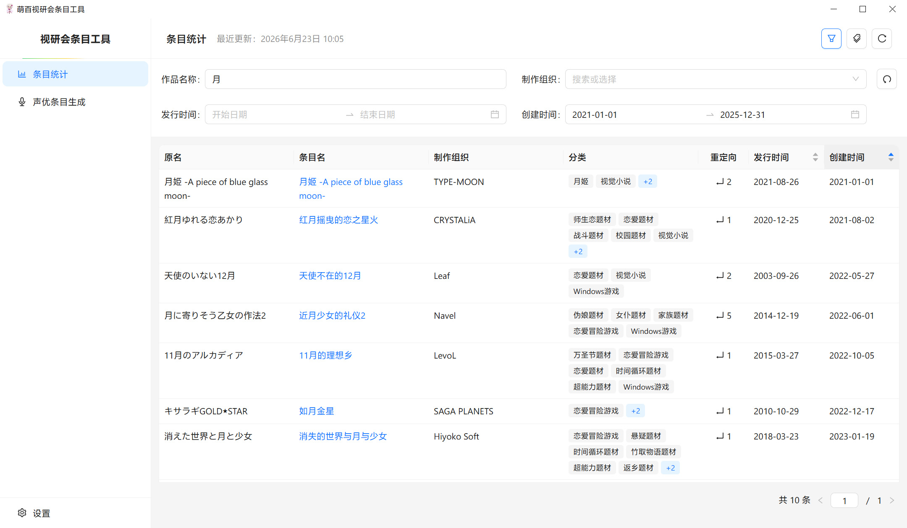
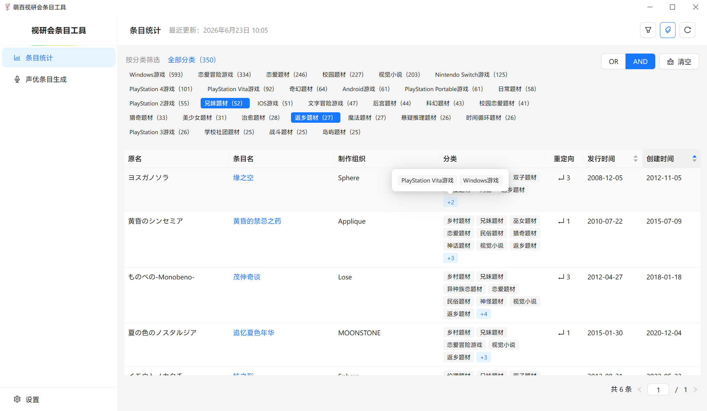
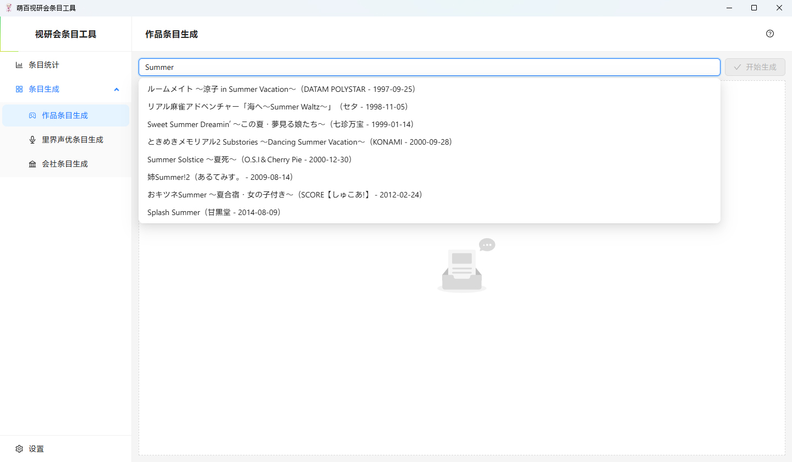
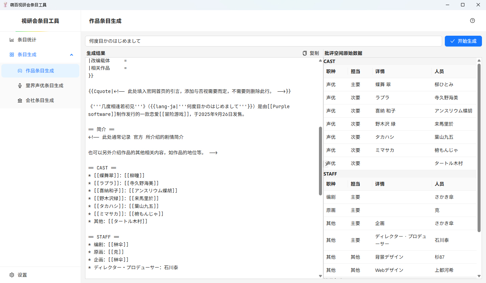
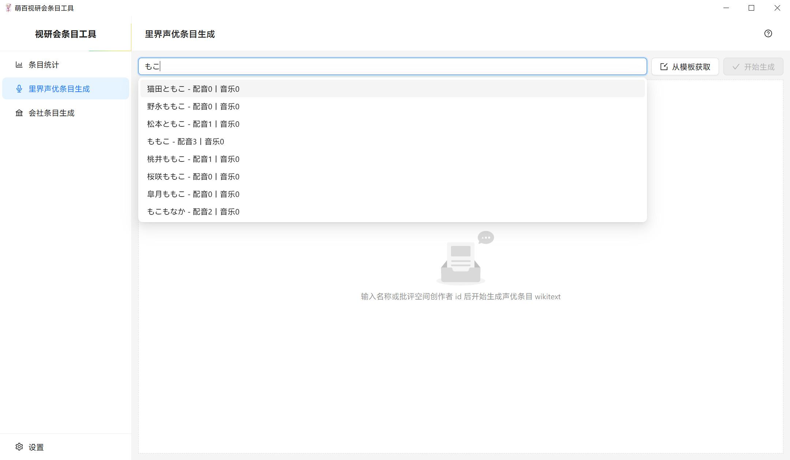
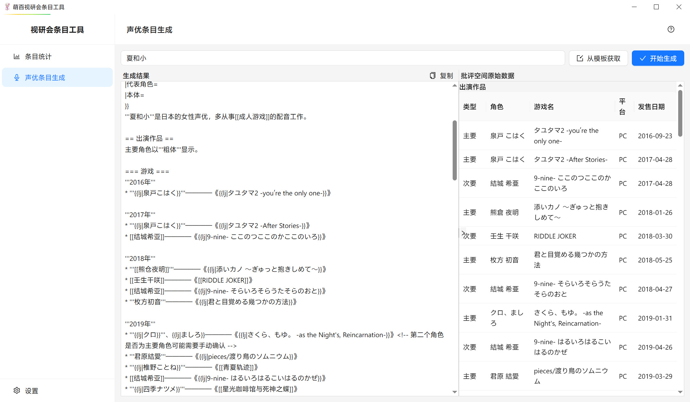
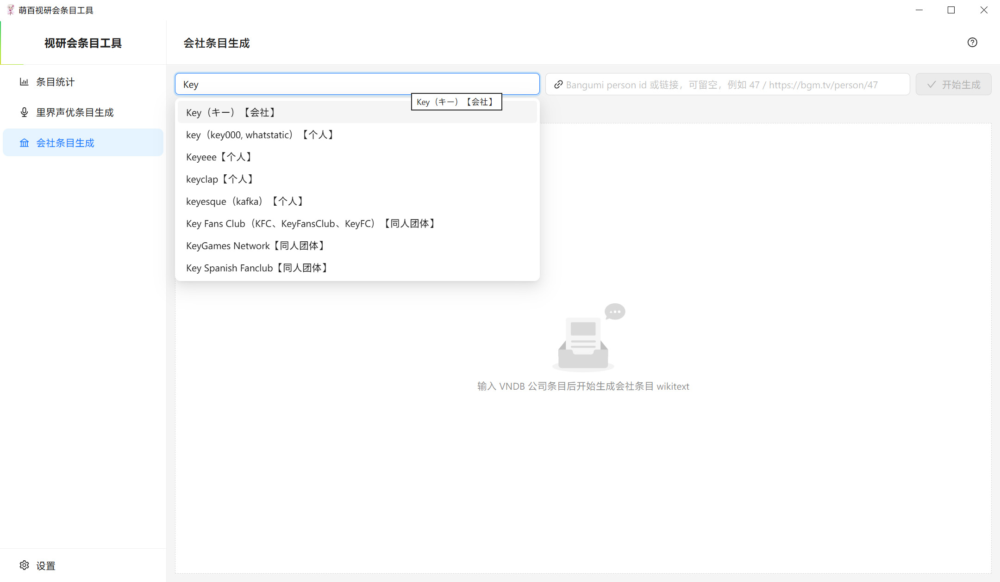
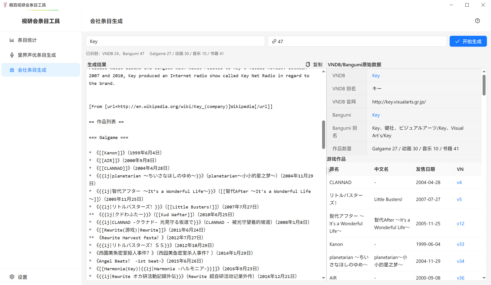

# 萌百视觉小说研究会条目工具

萌百视觉小说研究会条目工具，供[萌百视觉小说研究会](https://zh.moegirl.org.cn/Template:萌百视觉小说研究会)成员使用，用于生成条目代码、获取条目信息等。

由于本人技术能力有限，尤其 Rust 方面完全是个新手，后端部分代码高度依赖 AI 的编程及交叉验证，可能会有许多低质量代码，欢迎各路萌百人[参与完善](CONTRIBUTING.md)及提出建议。

- [下载](#下载)
- [使用须知](#使用须知)
- [功能](#功能)
  - [条目统计](#条目统计)
  - [作品条目生成](#作品条目生成)
  - [里界声优条目生成](#里界声优条目生成)
  - [会社条目生成](#会社条目生成)
- [License](#license)

## 下载

前往 [GitHub Releases](https://github.com/BearBin1215/mgp-vn-tool/releases) 下载对应平台的安装包：

| 平台 | 安装包格式 |
|------|-----------|
| Windows | `.exe` |
| macOS | `.dmg` / `.app` |
| Linux | `.deb` / `.rpm` / `.AppImage` |

## 使用须知

- 本工程使用 [Tauri v2](https://tauri.app/zh-cn/) 构建，理论上支持 Windows、macOS 和 Linux。但由于本人仅在 Windows 上开发，其他环境的表现可能不一致，出现其他系统专属 BUG 不保证修复。

## 功能

### 条目统计

从视研会飞书Galgame统计表获取条目数据，提供多维度筛选和表格展示，方便快速查找和浏览条目信息。获取的数据同时也会作为后续功能的基础。

- **条件筛选**：支持按作品名称、制作组织、发行时间范围、创建时间范围进行组合筛选
- **分类筛选**：自动从萌娘百科获取分类，支持按分类标签筛选

| 条件筛选 | 分类筛选 |
| ---- | ---- |
|  |  |

### 作品条目生成

通过批评空间数据库查询Galgame作品的基本信息、创作者等信息，自动生成萌娘百科条目的 wikitext 代码。

- **作品搜索**：输入名称查询或直接输入 ID 选择要生成条目的作品。
- **代码生成**：自动按照模板生成条目代码，制作人员、角色、音乐等信息根据条目统计数据自动生成内链。

| 作品搜索 | 生成结果 |
| ---- | ---- |
|  |  |

### 里界声优条目生成

通过批评空间数据库查询里界声优的出演作品、音乐作品等信息，自动生成萌娘百科条目的 wikitext 代码。

- **声优搜索**：输入名称查询或直接输入 ID 选择要生成条目的声优。
- **代码生成**：自动按照模板生成条目代码，作品根据条目统计数据自动生成内链，角色通过萌娘百科获取信息生成内链。同时页面右侧展示批评空间原始数据以供参考。

| 声优搜索 | 生成结果 |
| ---- | ---- |
|  |  |

### 会社条目生成

- 根据 VNDB、Bangumi 数据生成萌娘百科Galgame会社条目 wikitext。
- VNDB producer 条目获取会社基础信息、官网、别名、简介、游戏作品。
- （可选）Bangumi person 条目获取会社衍生动画、音乐、书籍列表。

| 会社搜索 | 生成结果 |
| ---- | ---- |
|  |  |

## License

[MIT License](LICENSE)
