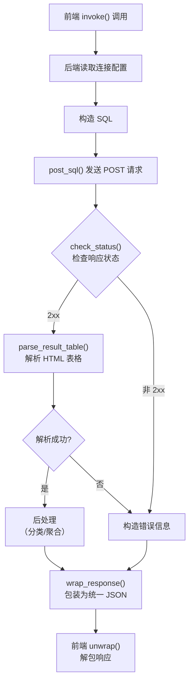

# ErogameScape API

本文档整理了批评空间（ErogameScape）的请求流程和数据表结构。数据表部分已删除对本项目无用的表和字段（如用户相关表、管理用字段等）。

数据表和字段名使用 AI 辅助翻译，可以对照[批评空间原文](http://erogamescape.dyndns.org/~ap2/ero/toukei_kaiseki/sql_for_erogamer_tablelist.php)使用。

- [批评空间链接](#批评空间链接)
- [请求流程](#请求流程)
- [常用函数](#常用函数)
  - [`read_settings`](#read_settings)
  - [`post_sql`](#post_sql)
  - [`parse_result_table`](#parse_result_table)
  - [`check_status`](#check_status)
  - [`wrap_response`](#wrap_response)
- [请求方式](#请求方式)
- [SQL示例](#sql示例)
- [数据表](#数据表)
  - [gamelist - 游戏信息](#gamelist---游戏信息)
  - [createrlist - 创作者信息](#createrlist---创作者信息)
  - [shokushu - 职种（游戏与创作者的关联信息）](#shokushu---职种游戏与创作者的关联信息)
  - [taglist - 标签信息](#taglist---标签信息)
  - [gamegrouplist - 游戏组信息](#gamegrouplist---游戏组信息)
  - [belong\_to\_gamegroup\_list - 游戏组与游戏的关联信息](#belong_to_gamegroup_list---游戏组与游戏的关联信息)
  - [reviewpagelist - 评测站评测信息](#reviewpagelist---评测站评测信息)
  - [attributelist - 属性信息](#attributelist---属性信息)
  - [attributegroupsboolean - 属性与游戏的关联信息](#attributegroupsboolean---属性与游戏的关联信息)
  - [connection\_between\_lists\_of\_games - 游戏之间的关联信息](#connection_between_lists_of_games---游戏之间的关联信息)


## 批评空间链接
* [数据表列表](http://erogamescape.dyndns.org/~ap2/ero/toukei_kaiseki/sql_for_erogamer_tablelist.php)
* [官方使用说明](http://erogamescape.dyndns.org/~ap2/ero/toukei_kaiseki/sql_for_erogamer_index.php)
* [实体联系图](http://erogamescape.dyndns.org/~ap2/ero/toukei_kaiseki/sql_doc/A5_ER.pdf)
* [SQL执行表单](http://erogamescape.dyndns.org/~ap2/ero/toukei_kaiseki/sql_for_erogamer_form.php)

## 请求流程



## 常用函数

以下函数定义在 `src-tauri/src/erogamescape.rs` 中，是后端处理批评空间请求的工具函数。

| 函数 | 作用 |
|------|------|
| `read_settings` | 从 Tauri Store 读取连接配置（URL、认证信息、超时时长） |
| `post_sql` | 向批评空间 SQL 页面发送 POST 请求 |
| `fetch_page` | 获取批评空间普通页面 HTML（非 SQL 接口），复用连接配置与认证 |
| `parse_result_table` | 解析SQL返回的 HTML ，返回结构化数据 |
| `check_status` | 检查 HTTP 状态码 |
| `wrap_response` | 将 `Result<Value, String>` 包装为 `{ statusCode, result, response }` JSON |

### `read_settings`

从 Tauri Store 中读取批评空间的连接配置，包含：
- `url`：批评空间地址（默认 `http://erogamescape.dyndns.org/~ap2/ero/toukei_kaiseki`）
- `username` / `password`：镜像站 HTTP Basic Auth 认证信息
- `timeout`：请求超时时长（秒，默认 20）

### `post_sql`

向批评空间 SQL 查询接口发送 POST 请求：
- 读取连接配置，拼接 SQL 查询地址
- 使用 `reqwest` 发送 POST 请求，`sql` 作为表单字段
- 镜像站自动附加 Basic Auth 认证
- 返回 `(HTTP 状态码, 原始 HTML 响应体)`

### `parse_result_table`

从批评空间返回的 HTML 页面中提取查询结果表格：
- 使用 `scraper` 库解析 HTML
- 定位 `#query_result_main` 选择器下的所有 `<table>`
- 跳过表头为"列名/型/内容"的数据表定义表格
- 返回 `(列名列表, 数据行列表)`

### `check_status`

校验 HTTP 响应状态码。

### `wrap_response`

将后端查询函数的结果统一包装为前端期望的 JSON 格式：
```json
{
  "statusCode": "200",
  "result": "success",
  "response": { ... }
}
```
失败时 `result` 为 `"fail"`，`response` 为错误信息字符串。

## 请求方式

SQL查询地址：`http://erogamescape.dyndns.org/~ap2/ero/toukei_kaiseki/sql_for_erogamer_form.php`

发送 POST 请求，sql语句作为表单里的sql字段传入。


## SQL示例

```sql
-- 根据创作者ID查询其参与的作品（声优出演+音乐作品）
SELECT
  s.shubetu,            -- 职业类型（1:原画 2:编剧 3:音乐 4:角色设计 5:声优 6:歌手 7:其他）
  s.shubetu_detail,     -- 1:主要 2:次要 3:其他
  s.shubetu_detail_name, -- 声优为角色名，音乐为歌曲名
  g.gamename,           -- 游戏名称
  g.sellday,            -- 发售日（未定则为2050-01-01）
  g.model               -- 平台（如 Windows）
FROM
  createrlist c
JOIN
  shokushu s ON c.id = s.creater
JOIN
  gamelist g ON s.game = g.id
WHERE
  c.id = 26545; -- 夏和小对应的id
```


## 数据表

### gamelist - 游戏信息

brandlist（品牌信息）在本项目中未使用，故省略。brandname列是brandlist的id外键。

| 列名 | 型 | 内容 |
|------|-----|------|
| id | integer | 主键 |
| gamename | text | 游戏名称 |
| furigana | text | 游戏名称的假名 |
| sellday | date | 发售日，未定则为2050-01-01 |
| brandname | integer | brandlist表的id外键 |
| median | integer | 游戏评分的中位数，每日计算 |
| stdev | integer | 游戏评分的标准偏差，每日计算 |
| count2 | integer | 游戏评分的数据量，每日计算 |
| comike | integer | [Getchu.com](http://www.getchu.com/top.html)的ID |
| shoukai | text | 游戏官方主页URL |
| model | text | 游戏机型 |
| erogame | boolean | 是否为成人游戏，t为成人游戏，f为非成人游戏 |
| banner_url | text | 横幅图URL |
| gyutto_id | integer | [Gyutto.com](http://gyutto.com/)的ID |
| dmm | text | [FANZA](http://www.dmm.co.jp/)的ID |
| dmm_genre | text | [FANZA](http://www.dmm.co.jp/)的URL的一部分 |
| dmm_genre_2 | text | [FANZA](http://www.dmm.co.jp/)的URL的一部分 |
| erogametokuten | integer | |
| total_play_time_median | integer | |
| time_before_understanding_fun_median | integer | |
| dlsite_id | text | DLsite ID（RJ号） |
| dlsite_domain | text | DLsite 站点域段，如 maniax/home |
| the_number_of_uid_which_input_pov | integer | |
| the_number_of_uid_which_input_play | integer | |
| total_pov_enrollment_of_a | integer | |
| total_pov_enrollment_of_b | integer | |
| total_pov_enrollment_of_c | integer | |
| trial_url | text | |
| trial_h | boolean | |
| okazu | boolean | |
| axis_of_soft_or_hard | integer | |
| trial_url_update_time | timestamp without time zone | |
| genre | text | |
| twitter | text | |
| erogetrailers | integer | |
| tourokubi | date | |
| digiket | text | |
| dmm_sample_image_count | integer | |
| dlsite_sample_image_count | integer | |
| gyutto_sample_image_count | integer | |
| digiket_sample_image_count | integer | |
| twitter_search | twitter_search | |
| tgfrontier | integer | |

---

### createrlist - 创作者信息

| 列名 | 型 | 内容 |
|------|-----|------|
| id | integer | 主键 |
| name | text | 创作者名字 |
| furigana | text | 创作者名字的假名 |
| title | text | 创作者官方主页的标题 |
| url | text | 创作者官方主页URL |
| circle | text | 创作者的同人社名 |
| twitter_username | text | 创作者的twitter ID |
| blog | text | 创作者的博客URL |
| pixiv | integer | 创作者的pixiv ID |
| blog_title | text | 创作者的博客标题 |

---

### shokushu - 职种（游戏与创作者的关联信息）

| 列名 | 型 | 内容 |
|------|-----|------|
| id | integer | 主键 |
| game | integer | gamelist表的id外键 |
| creater | integer | createrlist表的id外键 |
| shubetu | integer | 职种 1:原画 2:编剧 3:音乐 4:角色设计 5:声优 6:歌手 7:其他 |
| shubetu_detail | integer | 1:主要 2:次要 3:其他 |
| shubetu_detail_name | text | 声优为角色名，其他职种为职种名 |
| timestamp | timestamp without time zone | 数据注册时间 |

---

### taglist - 标签信息

| 列名 | 型 | 内容 |
|------|-----|------|
| name | text | 标签名 |
| timestamp | timestamp without time zone | 标签注册时间 |
| netabare | boolean | 剧透标记 t:有剧透 f:无剧透 |

---

### gamegrouplist - 游戏组信息

| 列名 | 型 | 内容 |
|------|-----|------|
| id | integer | 主键 |
| name | text | 游戏组名 |
| furigana | text | 游戏组名的假名 |

---

### belong_to_gamegroup_list - 游戏组与游戏的关联信息

| 列名 | 型 | 内容 |
|------|-----|------|
| id | integer | 主键 |
| gamegroup | integer | gamegroup表的id外键 |
| game | integer | gamelist表的id外键 |

---

### reviewpagelist - 评测站评测信息

| 列名 | 型 | 内容 |
|------|-----|------|
| id | integer | 主键 |
| game | integer | gamelist表的id外键 |
| reviewpage | integer | homepagelist表的id外键 |
| tokuten | integer | 评分 |
| tourokubi | timestamp with time zone | 注册时间 |
| memo | text | 备注 |
| link | text | 评测文章URL |

---

### attributelist - 属性信息

| 列名 | 型 | 内容 |
|------|-----|------|
| id | integer | 主键 |
| title | text | 属性名 |
| furigana | text | 属性的假名。假名前缀数字为分类：01:类型 02:声音 03:厂商配布 04:启动 05:系统 06:脚本 07:运行环境 08:其他机型 09:销售方式 10:作品形态 11:动画 12:主角 13:描写 0:其他 |

---

### attributegroupsboolean - 属性与游戏的关联信息

| 列名 | 型 | 内容 |
|------|-----|------|
| id | integer | 主键 |
| game | integer | gamelist表的id外键 |
| attribute | integer | attributelist表的id外键 |
| lock | boolean | 数据删除标记 t:不可删除 f:可删除 |

---

### connection_between_lists_of_games - 游戏之间的关联信息

| 列名 | 型 | 内容 |
|------|-----|------|
| id | integer | 主键 |
| game_subject | integer | gamelist表的id外键，●●是××的Fan disc (FD)中的●● |
| game_object | integer | gamelist表的id外键，●●是××的Fan disc (FD)中的×× |
| kind | text | 关联类型 fandisk:Fan disc (FD) remake:重制 transplant:移植版 bundling:同梱 sequel:续作 apend:追加 |
| memo | text | 备注 |
| timestamp | timestamp without time zone | 数据注册时间 |
