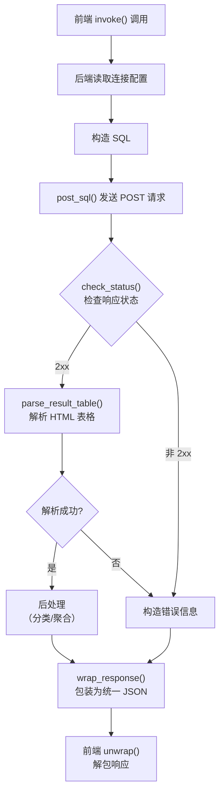

# ErogameScape API

本文档整理了批评空间（ErogameScape）的请求流程和数据表结构。数据表部分已删除对本项目无用的表和字段（如用户相关表、管理用字段等）。

数据表和字段名使用 AI 辅助翻译，可以对照[批评空间原文](http://erogamescape.dyndns.org/~ap2/ero/toukei_kaiseki/sql_for_erogamer_tablelist.php)使用。

- [批评空间链接](#批评空间链接)
- [请求流程](#请求流程)
- [常用函数](#常用函数)
  - [`read_settings`](#read_settings)
  - [`post_sql`](#post_sql)
  - [`fetch_page`](#fetch_page)
  - [`parse_result_table`](#parse_result_table)
  - [`check_status`](#check_status)
  - [`wrap_response`](#wrap_response)
- [请求方式](#请求方式)
- [SQL示例](#sql示例)
- [读取详情](#读取详情)
  - [作品详情](#作品详情)
  - [作品音乐详情](#作品音乐详情)
- [数据表](#数据表)
  - [brandlist - 厂牌信息](#brandlist---厂牌信息)
  - [gamelist - 游戏信息](#gamelist---游戏信息)
  - [createrlist - 创作者信息](#createrlist---创作者信息)
  - [shokushu - 职种（游戏与创作者的关联信息）](#shokushu---职种游戏与创作者的关联信息)
  - [taglist - 标签信息](#taglist---标签信息)
  - [gamegrouplist - 游戏组信息](#gamegrouplist---游戏组信息)
  - [belong\_to\_gamegroup\_list - 游戏组与游戏的关联信息](#belong_to_gamegroup_list---游戏组与游戏的关联信息)
  - [reviewpagelist - 评测站评测信息](#reviewpagelist---评测站评测信息)
  - [attributelist - 属性信息](#attributelist---属性信息)
  - [attributegroupsboolean - 属性与游戏的关联信息](#attributegroupsboolean---属性与游戏的关联信息)
  - [connection\_between\_lists\_of\_games - 游戏之间的关联信息](#connection_between_lists_of_games---游戏之间的关联信息)


## 批评空间链接
* [数据表列表](http://erogamescape.dyndns.org/~ap2/ero/toukei_kaiseki/sql_for_erogamer_tablelist.php)
* [官方使用说明](http://erogamescape.dyndns.org/~ap2/ero/toukei_kaiseki/sql_for_erogamer_index.php)
* [实体联系图](http://erogamescape.dyndns.org/~ap2/ero/toukei_kaiseki/sql_doc/A5_ER.pdf)
* [SQL执行表单](http://erogamescape.dyndns.org/~ap2/ero/toukei_kaiseki/sql_for_erogamer_form.php)

## 请求流程



## 常用函数

以下函数定义在 `src-tauri/src/erogamescape.rs` 中，是后端处理批评空间请求的工具函数。

| 函数 | 作用 |
|------|------|
| `read_settings` | 从 Tauri Store 读取连接配置（URL、认证信息、超时时长） |
| `post_sql` | 向批评空间 SQL 页面发送 POST 请求 |
| `fetch_page` | 获取批评空间普通页面 HTML（非 SQL 接口），复用连接配置与认证 |
| `parse_result_table` | 解析SQL返回的 HTML ，返回结构化数据 |
| `check_status` | 检查 HTTP 状态码 |
| `wrap_response` | 将 `Result<Value, String>` 包装为 `{ statusCode, result, response }` JSON |

### `read_settings`

从 Tauri Store 中读取批评空间的连接配置，包含：
- `url`：批评空间地址（默认 `http://erogamescape.dyndns.org/~ap2/ero/toukei_kaiseki`）
- `username` / `password`：镜像站 HTTP Basic Auth 认证信息
- `timeout`：请求超时时长（秒，默认 30）

### `post_sql`

向批评空间 SQL 查询接口发送 POST 请求：
- 读取连接配置，拼接 SQL 查询地址
- 使用 `reqwest` 发送 POST 请求，`sql` 作为表单字段
- 镜像站自动附加 Basic Auth 认证
- 返回 `(HTTP 状态码, 原始 HTML 响应体)`

### `fetch_page`

获取批评空间普通页面 HTML（非 SQL 接口）：
- 与 `post_sql` 共用 `read_settings` 的 URL/认证/超时配置，但走 GET 请求直接获取页面
- 用于 `query_work_music_detail` 抓取 `game.php` 与 `music.php` 详情页
- 状态非 2xx 时返回 `Err("HTTP {status}: {url}")`

### `parse_result_table`

从批评空间返回的 HTML 页面中提取查询结果表格：
- 使用 `scraper` 库解析 HTML
- 定位 `#query_result_main` 容器，其内仅有一个结果表格
- 返回 `(列名列表, 数据行列表)`；未找到数据表格时返回 `(vec![], vec![])`

错误提示分支：批评空间查询失败（如 SQL 执行成本超限、语法错误）时会返回 `<div id="query_result_main"><p>错误信息</p></div>`。此时若容器内存在非空 `<p>` 文本，将其作为 `Err` 返回，便于上层透传给前端。

### `check_status`

校验 HTTP 响应状态码。

### `wrap_response`

将后端查询函数的结果统一包装为前端期望的 JSON 格式：
```json
{
  "statusCode": "200",
  "result": "success",
  "response": { ... }
}
```
失败时 `result` 为 `"fail"`，`response` 为错误信息字符串；`statusCode` 从错误信息前缀 `HTTP {code}` 中提取，无前缀时为 `"0"`。

## 请求方式

SQL查询地址：`http://erogamescape.dyndns.org/~ap2/ero/toukei_kaiseki/sql_for_erogamer_form.php`

发送 POST 请求，sql语句作为表单里的sql字段传入。


## SQL示例

```sql
-- 根据创作者ID查询其参与的作品（声优出演+音乐作品），并取创作者基本信息
SELECT
  c.name,                    -- 创作者名字
  c.furigana,                -- 创作者名字的假名
  c.url,                     -- 创作者官方主页URL
  c.twitter_username,        -- 创作者的twitter ID
  c.blog,                    -- 创作者的博客URL
  c.blog_title,              -- 创作者的博客标题
  c.pixiv,                   -- 创作者的pixiv ID
  s.shubetu,                 -- 职种（5:声优 6:音乐，见 shokushu 表）
  s.shubetu_detail,          -- 1:主要 2:次要 3:其他
  s.shubetu_detail_name,     -- 声优为角色名，音乐为歌曲名
  g.id AS game_id,           -- 游戏ID（后端内部用于追加 Fan Disk/追加篇/重制版关联查询）
  g.gamename,                -- 游戏名称
  g.sellday,                 -- 发售日（未定则为2050-01-01）
  g.model                    -- 平台（如 Windows）
FROM
  createrlist c
LEFT JOIN
  shokushu s ON c.id = s.creater
LEFT JOIN
  gamelist g ON s.game = g.id
WHERE
  c.id = 26545; -- 夏和小对应的id
```

## 读取详情

`query_work_detail` 与 `query_work_music_detail` 用于作品条目生成，分别提供作品基本信息（含 STAFF/CAST/移植/续作）与音乐详情。

### 作品详情

`#[tauri::command] query_work_detail(app, work_id: u64)`

按作品 ID 查询作品详情，单次请求拿到作品自身信息，再分别请求关联作品与 STAFF/CAST（关联查询失败不阻断主流程）。

**请求流程**：
1. 自身信息：`gamelist g LEFT JOIN brandlist b ON g.brandname = b.id WHERE g.id = {work_id}`
   - 取 `gamename`/`sellday`/`model`/`shoukai`(官网)/`dlsite_id`/`dlsite_domain`/`twitter`/`brand`
2. 关联作品（`transplant`/`sequel`）：`connection_between_lists_of_games c JOIN gamelist g ON c.game_subject = g.id LEFT JOIN brandlist b ON g.brandname = b.id WHERE c.kind IN ('transplant','sequel') AND c.game_object = {work_id}`
   - transplant 取 `model`/`sellday`/`brand`（补充平台与发行商）
   - sequel 取 `gamename`（续作游戏名列表）
3. STAFF/CAST/歌手：`shokushu s JOIN createrlist c ON s.creater = c.id WHERE s.game = {work_id} AND s.shubetu IN (1,2,3,5,6,7)`
   - 前端按 shubetu 分流：5→CAST，1/2/3/6/7→STAFF/音乐
   - 注意未取 shubetu=4（角色设计）

**响应结构**：

```json
{
  "gamename": "GalExample",
  "sellday": "2017-11-24",
  "model": "Windows",
  "shoukai": "https://...",
  "dlsiteId": "RJxxxxx",
  "dlsiteDomain": "maniax/home",
  "twitter": "...",
  "brand": "BrandExample",
  "transplants": [{ "model": "...", "sellday": "...", "brand": "..." }],
  "sequels": ["..."],
  "staff": [
    { "shubetu": "5", "shubetuDetail": "1", "shubetuDetailName": "...", "name": "..." }
  ]
}
```

字段含义详见 `src/api/erogamescape.ts` 的 `WorkDetail`/`WorkTransplant`/`StaffRecord` 类型定义。

### 作品音乐详情

`#[tauri::command] query_work_music_detail(app, work_id: u64)`

抓取作品的音乐详情，用于作品条目生成的「相关音乐」章节。分类信息由 SQL（shokushu.shubetu=6 的 shubetu_detail_name）提供，本命令负责获取 per-song 的曲名与创作者。

**请求流程**：
1. 爬 `game.php?game={work_id}`，解析 `#music_summary_main` 表格拿到 `(music_id, song_name, summary_singer)`
   - 表格每行：第1列曲名含 `music.php?music=xxx` 链接，第3列为歌手
2. 并发爬取每个 `music.php?music={music_id}`（最大 3 并发，单曲失败跳过），解析 `#creaters_information_table` 拿作词/作曲/编曲/歌手
   - 按 `<a>` 标签拆分多个创作者，无 `<a>` 时按 `<br>` 拆分
   - 详情页歌手为空时回退用作品页的歌手名

**响应结构**（数组，每项一首曲子）：

```json
[
  {
    "musicId": "8659",
    "songName": "OP主题歌",
    "singer": ["歌手A", "歌手B"],
    "lyricist": ["作词人"],
    "composer": ["作曲人"],
    "arranger": ["编曲人"]
  }
]
```

字段含义详见 `src/api/erogamescape.ts` 的 `MusicCreatorDetail` 类型定义。

## 数据表

### brandlist - 厂牌信息

`gamelist.brandname` 是本表的 `id` 外键；`search_games` 与 `query_work_detail` 均会 JOIN 本表取 `brandname` 作为制作组织名。

| 列名 | 型 | 内容 |
|------|-----|------|
| id | integer | 主键 |
| brandname | text | 厂牌名 |
| brandfurigana | text | 厂牌名的假名 |
| url | text | 厂牌官方主页URL |
| kind | text | CORPORATION（企业）或 CIRCLE（同人） |
| lost | boolean | t 表示已解散 |
| directlink | boolean | t 表示禁止链接到首页以外 |
| median | integer | 该厂牌开发游戏评分中位数，每日计算 |
| twitter | text | 厂牌官方 twitter ID |

---

### gamelist - 游戏信息

| 列名 | 型 | 内容 |
|------|-----|------|
| id | integer | 主键 |
| gamename | text | 游戏名称 |
| furigana | text | 游戏名称的假名 |
| sellday | date | 发售日，未定则为2050-01-01 |
| brandname | integer | brandlist表的id外键 |
| median | integer | 游戏评分的中位数，每日计算 |
| stdev | integer | 游戏评分的标准偏差，每日计算 |
| count2 | integer | 游戏评分的数据量，每日计算 |
| comike | integer | [Getchu.com](http://www.getchu.com/top.html)的ID |
| shoukai | text | 游戏官方主页URL |
| model | text | 游戏机型 |
| erogame | boolean | 是否为成人游戏，t为成人游戏，f为非成人游戏 |
| banner_url | text | 横幅图URL |
| gyutto_id | integer | [Gyutto.com](http://gyutto.com/)的ID |
| dmm | text | [FANZA](http://www.dmm.co.jp/)的ID |
| dmm_genre | text | [FANZA](http://www.dmm.co.jp/)的URL的一部分 |
| dmm_genre_2 | text | [FANZA](http://www.dmm.co.jp/)的URL的一部分 |
| erogametokuten | integer | |
| total_play_time_median | integer | |
| time_before_understanding_fun_median | integer | |
| dlsite_id | text | DLsite ID（RJ号） |
| dlsite_domain | text | DLsite 站点域段，如 maniax/home |
| the_number_of_uid_which_input_pov | integer | |
| the_number_of_uid_which_input_play | integer | |
| total_pov_enrollment_of_a | integer | |
| total_pov_enrollment_of_b | integer | |
| total_pov_enrollment_of_c | integer | |
| trial_url | text | |
| trial_h | boolean | |
| okazu | boolean | |
| axis_of_soft_or_hard | integer | |
| trial_url_update_time | timestamp without time zone | |
| genre | text | |
| twitter | text | |
| erogetrailers | integer | |
| tourokubi | date | |
| digiket | text | |
| dmm_sample_image_count | integer | |
| dlsite_sample_image_count | integer | |
| gyutto_sample_image_count | integer | |
| digiket_sample_image_count | integer | |
| twitter_search | twitter_search | |
| tgfrontier | integer | |

---

### createrlist - 创作者信息

| 列名 | 型 | 内容 |
|------|-----|------|
| id | integer | 主键 |
| name | text | 创作者名字 |
| furigana | text | 创作者名字的假名 |
| title | text | 创作者官方主页的标题 |
| url | text | 创作者官方主页URL |
| circle | text | 创作者的同人社名 |
| twitter_username | text | 创作者的twitter ID |
| blog | text | 创作者的博客URL |
| pixiv | integer | 创作者的pixiv ID |
| blog_title | text | 创作者的博客标题 |

---

### shokushu - 职种（游戏与创作者的关联信息）

| 列名 | 型 | 内容 |
|------|-----|------|
| id | integer | 主键 |
| game | integer | gamelist表的id外键 |
| creater | integer | createrlist表的id外键 |
| shubetu | integer | 职种 1:原画 2:编剧 3:音乐 4:角色设计 5:声优 6:歌手 7:其他 |
| shubetu_detail | integer | 1:主要 2:次要 3:其他 |
| shubetu_detail_name | text | 声优为角色名，其他职种为职种名 |
| timestamp | timestamp without time zone | 数据注册时间 |

---

### taglist - 标签信息

| 列名 | 型 | 内容 |
|------|-----|------|
| name | text | 标签名 |
| timestamp | timestamp without time zone | 标签注册时间 |
| netabare | boolean | 剧透标记 t:有剧透 f:无剧透 |

---

### gamegrouplist - 游戏组信息

| 列名 | 型 | 内容 |
|------|-----|------|
| id | integer | 主键 |
| name | text | 游戏组名 |
| furigana | text | 游戏组名的假名 |

---

### belong_to_gamegroup_list - 游戏组与游戏的关联信息

| 列名 | 型 | 内容 |
|------|-----|------|
| id | integer | 主键 |
| gamegroup | integer | gamegroup表的id外键 |
| game | integer | gamelist表的id外键 |

---

### reviewpagelist - 评测站评测信息

| 列名 | 型 | 内容 |
|------|-----|------|
| id | integer | 主键 |
| game | integer | gamelist表的id外键 |
| reviewpage | integer | homepagelist表的id外键 |
| tokuten | integer | 评分 |
| tourokubi | timestamp with time zone | 注册时间 |
| memo | text | 备注 |
| link | text | 评测文章URL |

---

### attributelist - 属性信息

| 列名 | 型 | 内容 |
|------|-----|------|
| id | integer | 主键 |
| title | text | 属性名 |
| furigana | text | 属性的假名。假名前缀数字为分类：01:类型 02:声音 03:厂商配布 04:启动 05:系统 06:脚本 07:运行环境 08:其他机型 09:销售方式 10:作品形态 11:动画 12:主角 13:描写 0:其他 |

---

### attributegroupsboolean - 属性与游戏的关联信息

| 列名 | 型 | 内容 |
|------|-----|------|
| id | integer | 主键 |
| game | integer | gamelist表的id外键 |
| attribute | integer | attributelist表的id外键 |
| lock | boolean | 数据删除标记 t:不可删除 f:可删除 |

---

### connection_between_lists_of_games - 游戏之间的关联信息

| 列名 | 型 | 内容 |
|------|-----|------|
| id | integer | 主键 |
| game_subject | integer | gamelist表的id外键，●●是××的Fan disc (FD)中的●● |
| game_object | integer | gamelist表的id外键，●●是××的Fan disc (FD)中的×× |
| kind | text | 关联类型 fandisk:Fan disc (FD) remake:重制 transplant:移植版 bundling:同梱 sequel:续作 apend:追加 |
| memo | text | 备注 |
| timestamp | timestamp without time zone | 数据注册时间 |
