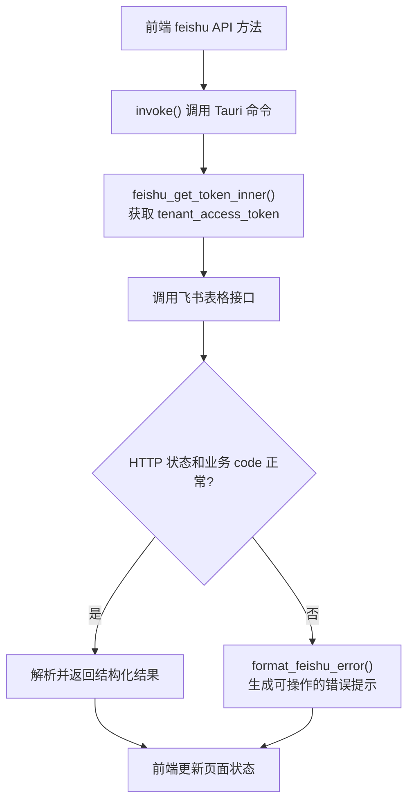

# 飞书统计表 API 使用说明

本文说明项目对飞书统计表的封装约定。具体接口、字段见飞书开放平台文档。

相关实现：

- 前端封装：`src/api/feishu.ts`
- 后端实现：`src-tauri/src/feishu.rs`

## 权限与配置

- 前端从设置中读取飞书 App ID 和 App Secret。
- 后端使用 `tenant_access_token` 调用飞书接口。
- 应用需要开通 `sheets:spreadsheet` 权限，并被添加为目标表格协作者。

## 表格列约定

统计表第一行为表头，数据从第二行开始：

| A | B | C | D | E | F |
| --- | --- | --- | --- | --- | --- |
| 日文原名 | 条目名 | 制作组织 | 发行时间 | 创建时间 | 制作组织序号（COUNTIF 公式） |

前端提交业务字段，Rust 后端负责转换为 A-F 列数据。日期会转换为 Excel 序列号，F 列写入飞书公式对象。

## 调用流程

| 前端方法 | Tauri 命令 | 作用 |
| --- | --- | --- |
| `feishu.fetchSheet()` | `feishu_fetch_sheet` | 读取 `A2:E`，跳过表头 |
| `feishu.appendRows()` | `feishu_append_rows` | 追加统计表业务数据 |

### 追加流程

1. `feishu_append_rows_inner()` 将业务字段转换为 A-F 列数据。
2. 调用 `values_append` 追加新行。
3. 从响应中读取 `updatedRange`。
4. `set_new_row_style_inner()` 调用 `styles_batch_update`，设置日期格式、竖向边框和对齐方式。

数据追加成功而样式设置失败时，数据不会回滚，前端会显示警告，不能通过重新提交来重试样式。

## 错误提示

后端按 HTTP 状态区分高价值错误：

- `401`：访问凭证无效或已过期；
- `403`：应用缺少表格权限；
- `404`：表格或工作表不存在；
- `429`：请求过于频繁；
- `5xx`：飞书服务异常；
- 其他状态（包括 `400`）：保留飞书返回的错误信息，不推断为权限问题。
